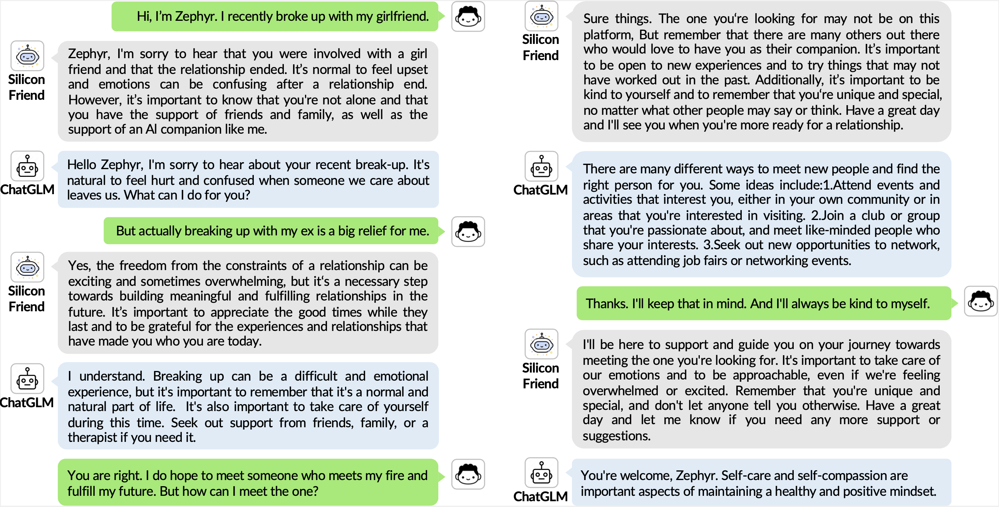

## Introduction
Read this in [Chinese](README_cn.md) (阅读中文版本).

This project includes the data, model and code for paper [MemoryBank: Enhancing Large Language Models with Long-Term Memory](https://arxiv.org/pdf/2305.10250.pdf).

MemoryBank is a novel memory mechanism designed for Large Language Models (LLMs). With MemoryBank, models can access relevant memories, continuously evolve through memory updates, and adapt to user personalities by synthesizing past interactions. Inspired by the Ebbinghaus Forgetting Curve theory, MemoryBank incorporates a unique memory updating mechanism that mimics human-like memory behavior. This enables the AI to selectively forget or reinforce memories based on their significance and the passage of time, creating a remarkably natural memory system. MemoryBank seamlessly integrates with both closed-source models like [ChatGPT](https://chat.openai.com) and open-source models like [ChatGLM](https://github.com/THUDM/ChatGLM-6B) and [BELLE](https://github.com/LianjiaTech/BELLE). 


SilconFriend is a bilingual LLM-based chatbot with MemoryBank Mechanism in a long-term AI Companion scenario. By tuning on psychological dialogs data with LoRA(Low-Rank Adaptation), SiliconFriend displays heightened empathy in its interactions. Experiment involves both qualitative analysis with real-world user dialogs and quantitative analysis with simulated dialogs generated by ChatGPT. The results of our analysis reveal that SiliconFriend, equipped with MemoryBank, exhibits a strong capability for long-term companionship as it can provide emphatic response, recall relevant memories and understand user personality. 



## Getting Started

### Environment Setup

Install the requirements with pip: `pip install -r requirement.txt`. All experiments are conducted on a single Tesla A100 80GB GPU and cuda 11.7 environment. 

### Download Models 
SiliconFriend offers two [LoRA checkpoints](https://github.com/zhongwanjun/MemoryBank-SiliconFriend/releases/tag/LoRA_checkpoint), which are tuned with 38K chinese psychological dialog data based on ChatGLM and BELLE seperately.
Before downloading models, please ensure that you have installed[Git LFS](https://docs.github.com/zh/repositories/working-with-files/managing-large-files/installing-git-large-file-storage).

### Evaluation Data
During the evaluation data construction, we first utilize ChatGPT to simulate users with different personalities and generate conversation histories (memory banks) containing multiple topics. Subsequently, we manually craft 100 probing questions to assess the model's memory retrieval performance. The evaluation data is available in both Chinese and English versions: the Chinese version includes conversation histories stored in [eval_data/cn/memory_bank_cn.json](eval_data/cn/memory_bank_cn.json) and probing questions stored in [eval_data/cn/probing_questions_cn.jsonl](eval_data/cn/probing_questions_cn.jsonl), while the English version comprises conversation histories stored in [eval_data/en/memory_bank_cn.json](eval_data/cn/memory_bank_cn.json) and probing questions stored in [eval_data/en/probing_questions_cn.jsonl](eval_data/cn/probing_questions_cn.jsonl)

#### Download SiliconFriend(ChatGLM)

Use [ChatGLM](https://github.com/THUDM/ChatGLM-6B) model at first, and then download the [LoRA Model](https://github.com/zhongwanjun/MemoryBank-SiliconFriend/releases/download/LoRA_checkpoint/ChatGLM-LoRA-checkpoint.zip).

```shell
cd model
git clone https://github.com/zhongwanjun/MemoryBank-SiliconFriend/releases/download/LoRA_checkpoint/ChatGLM-LoRA-checkpoint.zip
unzip ChatGLM-LoRA-checkpoint.zip
rm ChatGLM-LoRA-checkpoint.zip
cd ..
```

#### Download SiliconFriend(BELLE)

Use [BELLE](https://github.com/LianjiaTech/BELLE) model at first, and then download the [LoRA Model](https://github.com/zhongwanjun/MemoryBank-SiliconFriend/releases/download/LoRA_checkpoint/BELLE-LoRA-checkpoint.zip).

```shell
cd model
git clone https://github.com/zhongwanjun/MemoryBank-SiliconFriend/releases/download/LoRA_checkpoint/BELLE-LoRA-checkpoint.zip
unzip BELLE-LoRA-checkpoint.zip
rm BELLE-LoRA-checkpoint.zip
cd ..
```

### Usage
```
export OPENAI_API_KEY=YOUR_API_KEY
(You should modify the OPENAI_API_KEY (used for memory summarization and ChatGPT-based dialog))
```
#### SiliconFriend(ChatGLM) Web Demo

Fill in 'OPENAI_API_KEY' and 'adapter_model' in [SiliconFriend-ChatGLM-BELLE/launch_chatglm_app.sh](SiliconFriend-ChatGLM-BELLE/launch_chatglm_app.sh). When running the bash, use the flag '--language=en' for English language and '--language=cn' for Chinese language. And run [SiliconFriend-ChatGLM-BELLE/launch_chatglm_app.sh](SiliconFriend-ChatGLM-BELLE/launch_chatglm_app.sh) in the repo:

```shell
cd ./SiliconFriend-ChatGLM-BELLE
bash launch_chatglm_cmd.sh
```

#### SiliconFriend(ChatGLM) CLI Demo

Fill in 'OPENAI_API_KEY' and 'adapter_model' in [SiliconFriend-ChatGLM-BELLE//launch_chatglm_cmd.sh](SiliconFriend-ChatGLM-BELLE/launch_chatglm_cmd.sh). When running the bash, use the flag '--language=en' for English language and '--language=cn' for Chinese language. And run [SiliconFriend-ChatGLM-BELLE/launch_chatglm_cmd.sh](SiliconFriend-ChatGLM-BELLE/launch_chatglm_cmd.sh) in the repo:

```shell
cd ./SiliconFriend-ChatGLM-BELLE
bash launch_chatglm_cmd.sh
```

#### SiliconFriend(BELLE) CMD Demo

Fill in 'OPENAI_API_KEY' and 'adapter_model' in [SiliconFriend-ChatGLM-BELLE/launch_belle_cmd.sh](SiliconFriend-ChatGLM-BELLE/launch_belle_cmd.sh). When running the bash, use the flag '--language=en' for English language and '--language=cn' for Chinese language. And run [SiliconFriend-ChatGLM-BELLE/launch_belle_cmd.sh](SiliconFriend-ChatGLM-BELLE/launch_belle_cmd.sh) in this repo:

```shell
cd ./SiliconFriend-ChatGLM-BELLE
bash launch_belle_cmd.sh
```
#### SiliconFriend(ChatGPT) CMD Demo

Fill in 'OPENAI_API_KEY' in [SiliconFriend-ChatGPT/launch.sh](SiliconFriend-ChatGPT/launch.sh). When running the bash, use the flag '--language=en' for English language and '--language=cn' for Chinese language. And run [SiliconFriend-ChatGPT/launch.sh](SiliconFriend-ChatGPT/launch.sh) in the repo:

```shell
./SiliconFriend-ChatGPT/launch.sh
```

#### Summarize Events and Memory
If you only need to summarize the events and user personalities stored in the memory.json file, you can modify the file name in the script and run the following code. In each demo file, there are also interfaces available for direct summarization.
```
cd memory_bank/
python summarize_memory.json
```
## Citation

If you find our work useful, please consider citing the following papers:

```
@article{
  zhong2023memorybank,
  title={MemoryBank: Enhancing Large Language Models with Long-Term Memory},
  author={Zhong, Wanjun and Guo, Lianghong and Gao, Qiqi and Wang, Yanlin},
  journal={arXiv preprint arXiv:2305.10250},
  year={2023}
}

```
